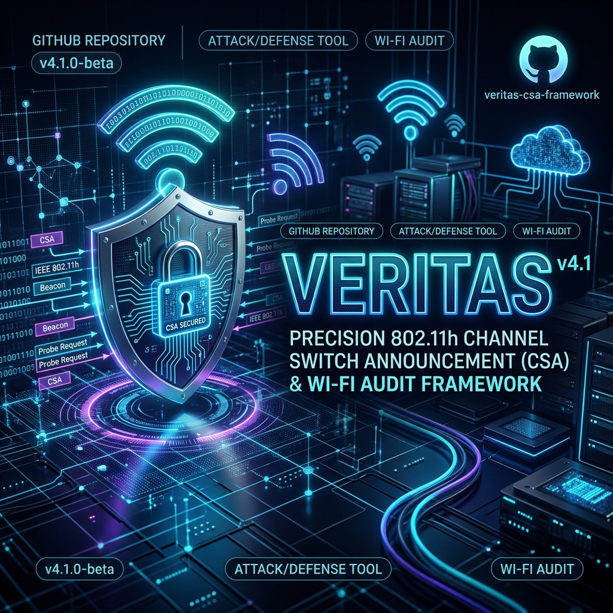

# VERITAS v4.7 — Kerangka Kerja Audit Keamanan & Pengujian Presisi Wi-Fi 802.11 CSA



[](LICENSE)
[-red.svg)](https://kernel.org)
[](veritas.c)
[](Makefile)
[](veritas.c)

**VERITAS** (*Channel Switch Announcement Attack & Audit Framework*) adalah perkakas evaluasi keamanan nirkabel berkinerja tinggi berbasis C11 murni dan Python 3. Perkakas ini dirancang khusus untuk audit jaringan Wi-Fi, manipulasi standar IEEE 802.11h CSA, penyerangan fragmen *FragAttack*, agresivitas kanal DFS (*Operating Channel Aggression*), dan penyebaran Titik Akses Palsu (*Rogue Access Point*). Dibangun kembali dari awal untuk menggantikan kerangka kerja Python yang berat, VERITAS versi C11 mampu menyuntikkan paket data langsung ke soket mentah (*raw socket*) dengan kecepatan melebihi 5.000 paket per detik (PPS) serta didukung pengontrol laju presisi berakurasi sub-milidetik.

---

## ⚡ Fitur Utama

- **🚀 Injeksi Berkecepatan Tinggi (Zero-Copy Templating)**: Memanfaatkan teknik pembaruan *memory pointer* mentah tanpa penyalinan data (*Zero-Copy*) dipadukan dengan soket mentah `AF_PACKET` dan mode transmisi massal `sendmmsg()` (hingga 16 paket per satu panggilan sistem/*syscall*) serta optimasi memori pemancar kernel hingga 2MB (`SO_SNDBUF`).
- **🥷 Bypass IDS/WIPS & OUI Spoofing**: Menghasilkan pemalsuan *MAC Address* berlapis (*OUI-Aware Spoofing*) yang dirancang khusus agar menyamar sebagai vendor gawai sah (Apple, Intel, Samsung) tanpa memicu alarm deteksi berbasis anomali dari sistem pertahanan nirkabel korporat (WIPS/IDS).
- **📡 TX-Power & Regulatory Domain Unlock Guidance**: Menyertakan peringatan khusus ketika mode tempur tinggi (`--insane`) dijalankan, yang menginstruksikan pengguna secara mandiri memutus batasan daya pancar Kernel Linux hingga 1000mW (30dBm) demi jangkauan serangan absolut (tanpa menyebabkan reset monitor mode paksa).
- **🔍 Pembuka Jaringan Tersembunyi Active Probe Sweep (`--unmask-hidden`)**: Menyuntikkan *Probe Request Broadcast* secara aktif dan mengekstrak *Probe Response* serta *Directed Probe Request* untuk membuka identitas nama SSID yang disembunyikan (*Hidden SSID*) secara real-time.
- **🔒 Mesin Multithread Tanpa Pengunci (*Lock-Free Engine*)**: Eksekusi pengujian multi-vektor secara bersamaan ditenagai oleh `<stdatomic.h>` dan deskriptor soket per-utas (*per-thread*) untuk mencegah hambatan antrean memori.
- **⚖️ AP Pool Sharding (Multi-Threading Load Balancer)**: Pada skenario Dual-Band, pembelahan beban kerja *Thread* dilakukan secara terisolasi penuh. *Injector* Radio 1 memfokuskan transmisi ke saluran 2.4GHz, dan Radio 2 berfokus penuh ke 5GHz, menghilangkan tumpang tindih jaringan (*network overlap*) pada mode injeksi massal.
- **🎯 18 Vektor Serangan Khusus**:
  1. `CSA Beacon Flood`: Banjir *Beacon* pengalihan saluran IEEE 802.11h.
  2. `Quiet Element DoS`: Penghentian komunikasi nirkabel berbasis elemen *Quiet* 802.11h.
  3. `Bidirectional Deauth Flood`: Pemutusan hubungan dua arah selang-seling (AP → Klien dan Klien → AP).
  4. `Disassociation Flood`: Banjir *frame* pemutusan asosiasi jaringan.
  5. `EAPOL Logoff Spoofing`: Pemalsuan *frame* EAPOL-Logoff dengan bit *ToDS* presisi.
  6. `PMKID Auto-Capture`: Penangkapan otomatis handshake PMKID M1 dan format keluaran langsung ke Hashcat `22000`.
  7. `Auth Table Exhaustion DoS`: Banjir autentikasi menggunakan alamat MAC acak untuk menghabiskan tabel memori AP.
  8. `CSA Action Frame Injection`: Injeksi *Action Frame* CSA khusus terarah (kategori 0, aksi 4/5).
  9. `Beacon Confusion / Rogue BSSID Injection`: Pemalsuan ribuan *Beacon* dengan BSSID acak untuk mengacaukan pemindai.
  10. `Probe Response CSA Spoofing`: Pemalsuan *Probe Response* berisi CSA (ditujukan khusus ke klien atau siaran).
  11. `DELBA (Delete Block Ack) DoS`: Penghentian agregasi paket data berbasis *frame Action* DELBA.
  12. `Power Save DoS`: Pemalsuan indikator *Power Save* (*TIM Element*) untuk menahan paket data klien.
  13. `FragAttack Injection` (CVE-2020-24588): Manipulasi *header* fragmentasi untuk menyuntikkan data teks polos (*plaintext*) tanpa perlu mengetahui kata sandi Wi-Fi.
  14. `Operating Channel Aggression (DFS Fake Radar)`: Pemalsuan deteksi radar militer/cuaca pada kanal DFS 5 GHz melalui *Measurement Report* (bit Radar) + *Beacon* CSA `stop-TX`, memaksa AP mematikan kanal dan mengunci transmisi selama beberapa menit sesuai regulasi DFS penerbangan.
  15. `CTS/RTS Virtual Jammer` (**BARU**): Memancarkan paket *Clear to Send* (CTS) dengan nilai *Duration Field* (NAV) maksimum (32767 µs), memaksa semua perangkat di frekuensi udara terdiam patuh. Sangat efektif melumpuhkan router tangguh seperti Huawei tanpa memutus status koneksi fisik.
  16. `WPA3 SAE Hunting & Puzzling` (**BARU**): Membanjiri permintaan jabat tangan WPA3 SAE Commit yang memaksa router melakukan kalkulasi matematika kurva eliptik (ECDH) secara massal, menguras CPU router modern hingga 100% dan memicu *hang* atau *crash* akibat kelelahan komputasi (*Crypto Puzzle Exhaustion* / CVE-2019-9494 Dragonblood).
  17. `BSS Transition Attack (802.11v Steer)` (**BARU**): Mengirimkan paket manajemen *BSS Transition Request* palsu atas nama router utama, memaksa perangkat korban berpindah (*roaming*) ke jaringan tiruan (*Rogue AP*) secara halus tanpa kecurigaan sistem.
  18. `Beacon Report Drain (Battery Exploitation)` (**BARU**): Mengirimkan *Radio Measurement Request* secara terus-menerus ke HP/laptop target, memaksa perangkat korban memindai (*scan*) seluruh frekuensi latar belakang tanpa henti, menguras baterai hingga cepat habis dan panas ekstrem.
- **🌐 Dukungan Dual-Band (2.4GHz / 5GHz) & Peka DFS**: Mendukung penuh saluran frekuensi tinggi 5GHz (saluran 36–165), konfigurasi VHT `hostapd` 802.11ac, serta peringatan otomatis untuk saluran DFS (52–64, 100–144).
- **💥 Mode Uji Stress Lapangan / Injeksi Massal (Gaya mdk4)**: Memindai seluruh sinyal nirkabel di udara secara pasif, membangun daftar AP secara otomatis, dan menginjeksi serangan ke seluruh AP yang terdeteksi secara simultan dengan *channel hopping* otomatis di spektrum 2.4GHz dan 5GHz.
- **⏱️ Pengontrol Laju Berbasis Sliding Window PID**: Mesin pengontrol laju transmisi berbasis algoritma PID pada setiap utas memastikan kelancaran injeksi sesuai mode agresivitas (`STEALTH` ~20 PPS hingga `INSANE` ~5000 PPS).
- **🤖 Otomatisasi Skrip JSON**: Dukungan penuh pengujian terototimatisasi (*headless mode*) melalui file konfigurasi JSON.

---

## 📋 Prasyarat & Persyaratan Sistem

### Kebutuhan Minimum
- **Sistem Operasi**: Linux Kernel 5.14+ (Mendukung `AF_PACKET` soket mentah & flag `PACKET_IGNORE_OUTGOING`).
- **Hak Akses**: Pengguna `root` atau kapabilitas POSIX `CAP_NET_RAW`.
- **Perangkat Keras**: Kartu Jaringan Nirkabel (NIC) yang mendukung **Mode Monitor** dan **Packet Injection** (Contoh: Alfa AWUS036ACH, Atheros AR9271, MediaTek MT7612U).

### Dependensi Sistem
- `iw`: Diperlukan untuk perpindahan frekuensi/saluran nirkabel.
- `airodump-ng` (*Opsional*): Diperlukan untuk pemindaian target otomatis pada mode interaktif biasa.
- `hostapd` (*Opsional*): Diperlukan dalam skenario pembuatan Titik Akses Tiruan (*Evil Twin Rogue AP*).
- `python3` (*Opsional*): Jika ingin menjalankan versi skrip Python (`veritas.py`).

---

## 🛠️ Instalasi & Kompilasi

Kloning repositori dan lakukan kompilasi biner C menggunakan `gcc` melalui `make`:

```bash
# Kloning repositori proyek
git clone https://github.com/mrcat2890-droid/Veritas.git
cd veritas

# Kompilasi biner rilis (Optimasi Produksi -O2)
make

# Opsional: Instalasi biner secara global ke sistem (/usr/local/bin)
sudo make install
```

### Perintah Pengelolaan Build (`Makefile`)

| Perintah | Deskripsi |
| :--- | :--- |
| `make` | Mengompilasi biner rilis utama yang dioptimalkan (`./veritas`) |
| `make debug` | Kompilasi biner dengan simbol penguji memori AddressSanitizer & UndefinedBehaviorSanitizer (`./veritas_dbg`) |
| `make clean` | Menghapus seluruh biner dan berkas hasil kompilasi |
| `make install` | Memasang biner `./veritas` ke direktori `/usr/local/bin` |
| `make uninstall` | Menghapus biner dari direktori `/usr/local/bin/veritas` |

---

## 📖 Panduan Penggunaan

### 1. Mode CLI Interaktif (Satu Target Spesifik)

Jalankan VERITAS secara interaktif untuk memindai jaringan target, memilih vektor serangan, dan mengatur laju kecepatan:

```bash
sudo ./veritas
```

#### Opsi Perintah Baris (*Command-Line Flags*)

```bash
sudo ./veritas [OPSI]

Opsi Utama:
  --pmkid         Mengaktifkan penangkapan handshake PMKID M1 otomatis ke /tmp/veritas_pmkid_*.22000
  --ids-bypass    Mengaktifkan manipulasi jeda waktu (jitter timing) untuk meminimalkan deteksi WIDS/WIPS
  --dual <iface>  Mengaktifkan mode dual-radio menggunakan adaptor nirkabel sekunder
  --rogue         Menjalankan Rogue AP otomatis pada saluran pengalihan target
  --stats <file>  Menulis data statistik JSON secara langsung ke berkas tujuan
  --help          Menampilkan panduan penggunaan dan penjelasan parameter
```

---

### 2. Mode Uji Stress Lapangan / Injeksi Massal (`--stress`)

Mode ini terinspirasi dari `mdk4`. VERITAS tidak memerlukan BSSID target tertentu, melainkan akan memindai seluruh sinyal di udara dan menyuntikkan serangan ke semua jaringan yang terdeteksi:

```bash
# Uji stress pada spektrum 2.4GHz
sudo ./veritas --stress

# Uji stress pada spektrum Dual-Band (2.4GHz + 5GHz) dengan Single Radio
sudo ./veritas --stress --5ghz

# Uji stress pada spektrum Dual-Band secara paralel (Multi-Radio Load Balancing)
# wlan0 akan dikhususkan untuk 2.4GHz, wlan1 untuk 5GHz
sudo ./veritas --stress --5ghz --dual wlan1
```

---

### 3. Mode Otomatis / Skrip Terjadwal (Konfigurasi JSON)

Pengujian dapat dijalankan secara terotomatisasi (*headless mode*) dengan menyertakan file konfigurasi JSON:

```bash
sudo ./veritas --script config.example.json
```

#### Contoh Berkas Konfigurasi JSON (`config.example.json`)

```json
{
  "interface": "wlan0mon",
  "target_bssid": "00:11:22:33:44:55",
  "target_ssid": "Target_Wi-Fi_Perusahaan",
  "target_channel": 6,
  "new_channel": 36,
  "client_mac": "FF:FF:FF:FF:FF:FF",
  "duration": 30,
  "mode": "HIGH",
  "vectors": [
    "CSA Beacon Flood",
    "Deauth Flood",
    "CSA Action Frame",
    "FragAttack Injection"
  ],
  "log_pmkid": true,
  "ids_bypass": false,
  "spawn_rogue": true,
  "rogue_ssid": "Wi-Fi_Perusahaan_5G",
  "stats_file": "/tmp/veritas_stats.json"
}
```

---

### 4. Versi Python (`veritas.py`)

Selain biner C11, VERITAS juga menyediakan implementasi Python 3 berbasis Scapy dengan fungsionalitas dan 16 vektor serangan yang setara:

```bash
sudo python3 veritas.py
```

---

## 🔬 Mekanisme Teknis IEEE 802.11h CSA, FragAttack & DFS Fake Radar

### 1. Channel Switch Announcement (CSA)
Standar IEEE 802.11h mendefinisikan *Channel Switch Announcement* (CSA) melalui Elemen Informasi ID 37. Fitur ini dirancang agar Titik Akses (AP) dapat memberitahukan seluruh klien terhubung bahwa AP akan berpindah saluran frekuensi operasi:

```
  802.11 Frame Manajemen (Beacon / Action / Probe Response)
 ┌─────────────────────────────────────────────────────────────┐
 │ IEEE 802.11 Header (FC: 0x0080 / 0x00D0)                    │
 ├─────────────────────────────────────────────────────────────┤
 │ SSID Element (ID 0)                                         │
 ├─────────────────────────────────────────────────────────────┤
 │ DS Parameter Set (ID 3) -> Saluran Saat Ini                 │
 ├─────────────────────────────────────────────────────────────┤
 │ CSA Element (ID 37)                                         │
 │  ├── Switch Mode (1 byte)  : 1 (Hentikan TX hingga pindah)   │
 │  ├── New Channel (1 byte)  : Saluran Tujuan (misal Ch 36)   │
 │  └── Switch Count (1 byte): 0 (Pindah seketika)             │
 └─────────────────────────────────────────────────────────────┘
```

### 2. FragAttack (Fragment Header Manipulation)
Penyerangan berbasis CVE-2020-24588 memecah *frame* data menjadi dua fragmen terpisah:
- **Fragmen 0**: Mengandung *header* LLC/SNAP (IPv4) dan bagian depan permintaan ARP dengan indikator `MoreFragments = 1`.
- **Fragmen 1**: Mengandung sisa muatan data terinjeksi (seperti *probe ICMP echo*) dengan indikator `MoreFragments = 0`.

Perangkat penerima yang rentan akan menggabungkan kedua fragmen tersebut di dalam memori RAM tanpa memvalidasi enkripsi per-fragmen, sehingga muatan teks polos (*plaintext*) berhasil disuntikkan tanpa mengetahui kunci enkripsi Wi-Fi.

### 3. Operating Channel Aggression (DFS Fake Radar)
Vektor #16 memalsukan sinyal deteksi radar (militer/cuaca) pada kanal DFS 5 GHz melalui dua *frame* IEEE 802.11h Spectrum Management:

1. **Measurement Report Action** (Kategori 0 / Aksi 1) berisi *Basic Report* dengan bit Radar (`Map = 0x08`) pada saluran operasi target — dikirim seolah-olah dari klien ke AP.
2. **CSA Beacon** spoofed dari BSSID dengan `mode=1` (hentikan TX) dan `count=0` (pindah seketika) ke saluran non-DFS yang aman — mensimulasikan respons wajib AP saat radar terdeteksi.

AP yang patuh regulasi DFS (ETSI EN 301 893 / FCC Part 15) dapat mematikan kanal secara mendadak dan mengunci transmisi selama *Channel Availability Check* (CAC) atau *Non-Occupancy Period* (beberapa menit) sebelum kanal boleh dipakai kembali.

---

## 📊 Hasil Pengujian & Benchmark Kinerja

*Diuji pada prosesor Intel Core i7-1185G7 menggunakan adaptor Alfa AWUS036ACH (Chipset Realtek RTL8812AU):*

| Mode Agresivitas | Target PPS | Realisasi Transmisi PPS | Penggunaan CPU | Pergantian Konteks / Detik |
| :--- | :--- | :--- | :--- | :--- |
| `STEALTH` | 20 | 20.1 | < 0.2% | ~20 |
| `MEDIUM` | 200 | 199.8 | < 0.5% | ~180 |
| `HIGH` | 500 | 499.5 | ~1.1% | ~450 |
| `INSANE` | 5000 | 4982.0 | ~4.8% | ~350 (Menggunakan `sendmmsg`) |

---

## 🛡️ Strategi Mitigasi & Pengerasan Keamanan

Untuk melindungi infrastruktur nirkabel dari kerentanan manipulasi CSA, FragAttack, DFS Fake Radar, dan Titik Akses Tiruan:

1. **Aktifkan Protected Management Frames (PMF / IEEE 802.11w)**:
   - Wajibkan penggunaan WPA3 atau aktifkan opsi `ieee80211w=2` (Wajib) pada pengontrol Wi-Fi perusahaan Anda. PMF mengenkripsi *frame* manajemen sehingga tidak dapat dipalsukan oleh penyerang.
2. **Pembaruan Perangkat Lunak (*Firmware Patching*)**:
   - Terapkan pembaruan perangkat keras teranyar untuk menambal kerentanan reassembly fragmentasi *FragAttack*.
3. **Implementasi WIDS/WIPS Modern**:
   - Gunakan sistem deteksi nirkabel yang memantau anomali rasio transmisi *Beacon/Action Frame* berulang serta *Measurement Report* palsu yang mengklaim deteksi radar pada kanal DFS.
4. **Kebijakan Kanal DFS**:
   - Pertimbangkan membatasi operasi AP pada UNII-1 / UNII-3 non-DFS bila ketersediaan layanan lebih kritis daripada kapasitas spektrum, atau validasi sumber *radar event* di sisi pengontrol.

---

## ⚠️ Penyangkalan Etis & Tanggung Jawab Hukum

> [!CAUTION]
> **VERITAS dikembangkan secara eksklusif untuk tujuan audit keamanan yang sah, pengujian penetrasi terotorisasi, dan riset akademis.**
> Penggunaan perangkat lunak ini untuk mengakses atau mengganggu jaringan nirkabel tanpa izin tertulis dari pemilik aset adalah tindakan ilegal di bawah hukum nasional dan internasional (seperti Undang-Undang Informasi dan Transaksi Elektronik / UU ITE di Indonesia serta *Computer Fraud and Abuse Act* / CFAA di Amerika Serikat). Pengembang tidak bertanggung jawab atas segala bentuk penyalahgunaan, kerugian, atau konsekuensi hukum yang timbul dari penggunaan proyek ini.

---

## 📄 Lisensi

Proyek ini didistribusikan di bawah lisensi resmi **MIT License**. Lihat berkas [`LICENSE`](LICENSE) untuk informasi selengkapnya.
